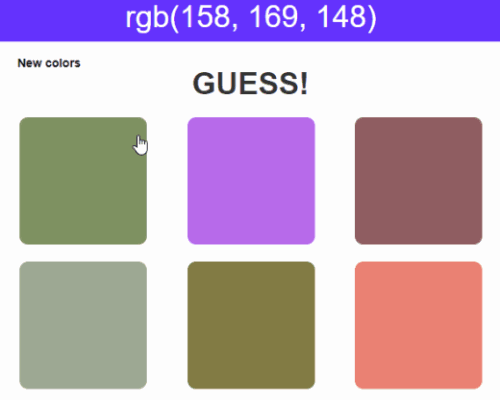

# RGBGuess

Author _beta admin team

## Aufgabe / Task

### Deutsch/German:
Ablauf des Programms soll es sein, sich 6 verschiedene Farben per Zufallsprinzip generieren zu lassen (rgb(0-255, 0-255, 0-255)).
Diese 6 Farben werden dazu benutzt, die 6 

 einzufärben, sodass jedes "square" jeweils eine zufällige Farbe repräsentiert.

Eine der zuvor generierten Farben wird als Zeichenkette in das `<h1>` tag geschrieben (Beispiel: rgb(100, 50, 40)) und ersetzt den Text "Replace with color to guess".
Klickt der Benutzernun auf ein "square" wird überprüft, ob Farbe des gewählten "square" mit der zu erratenen Farbe übereinstimmt. 
Stimmt sie überein ist das Spiel gewonnen, wenn nicht, wird das "square" ausgeblendet und der Benuzter erhält einen erneuten Versuch.

Zusammenfassung:
1. Generieren Sie beim Klick des `<button id="new_color">` sechs zufällige Farben (RGB-Farbraum).
2. Ordnen Sie jedem `
` eine dieser Farben zu und färben sie den "square" dementsprechend ein.
3. Zeigen Sie einen der generierten Farben als Zeichenkette im `<h1 id="colorToGuess">` an: z.B.: "rgb(100, 50, 40)".
4. Prüfen Sie beim Klick auf eine Farbe im `
` ob die Farbe mit der zu erratenden Farbe übereinstimmt.
  a. Stimmen überein - Spiel gewonnen
  b. Stimmen nicht überein - Geklickten `
` auslenden und erneuten Versuch abwarten. (Schritt 4)
5. Das Spiel kann durch einen Klick auf `<button id=new"color">` erneut gestartet werden.

Hinweise:
- Ein Beispiel als Animiertes GIF finden Sie unter /src/example/rgbGuess.gif

- Die Visualisierung kann Ihrerseits geändert/gewählt werden.

### Englisch/English:

The program should be able to generate 6 different colors randomly (rgb(0-255, 0-255, 0-255)).
These 6 colors are used to colorize the 6 `

` so that each "square" represents a random color.

One of the previously generated colors is written as a string into the `<h1>` tag (example: rgb(100, 50, 40)) and replaces the text "Replace with color to guess".
If the user clicks on a square it is checked if the color of the selected square matches the color to guess. 
If it matches, the game is won, if not, the square is hidden and the user gets another try.

Summary:
  1. Generate six random colors (RGB color space) when clicking the `<button id="new_color">`.
  2. Assign one of these colors to each `
` and colorize the "square" accordingly
  3. Display one of the generated colors as a string in the `<h1 id="colorToGuess">`: e.g: "rgb(100, 50, 40)".
  4. When you click on a color in `
` check if the color matches the color you want to guess.
    a. Match - game won
    b. Not match - Hide clicked `
` and wait for a new attempt. (Step 4)
  5. The game can be restarted by clicking on `<button id=new "color">`.

Hints:
- An example as animated GIF can be found at /src/example/rgbGuess.gif

- The visualization can be changed/selected by you.

# Getting Started with Create React App

This project was bootstrapped with [Create React App](https://github.com/facebook/create-react-app).

## Available Scripts

In the project directory, you can run:

### `npm start`

Runs the app in the development mode. 
Open [http://localhost:3000](http://localhost:3000) to view it in the browser.

The page will reload if you make edits. 
You will also see any lint errors in the console.

### `npm test`

Launches the test runner in the interactive watch mode. 
See the section about [running tests](https://facebook.github.io/create-react-app/docs/running-tests) for more information.

### `npm run build`

Builds the app for production to the `build` folder. 
It correctly bundles React in production mode and optimizes the build for the best performance.

The build is minified and the filenames include the hashes. 
Your app is ready to be deployed!

See the section about [deployment](https://facebook.github.io/create-react-app/docs/deployment) for more information.

### `npm run eject`

**Note: this is a one-way operation. Once you `eject`, you can’t go back!**

If you aren’t satisfied with the build tool and configuration choices, you can `eject` at any time. This command will remove the single build dependency from your project.

Instead, it will copy all the configuration files and the transitive dependencies (Webpack, Babel, ESLint, etc) right into your project so you have full control over them. All of the commands except `eject` will still work, but they will point to the copied scripts so you can tweak them. At this point you’re on your own.

You don’t have to ever use `eject`. The curated feature set is suitable for small and middle deployments, and you shouldn’t feel obligated to use this feature. However we understand that this tool wouldn’t be useful if you couldn’t customize it when you are ready for it.

## Learn More

You can learn more in the [Create React App documentation](https://facebook.github.io/create-react-app/docs/getting-started).

To learn React, check out the [React documentation](https://reactjs.org/).

### Code Splitting

This section has moved here: https://facebook.github.io/create-react-app/docs/code-splitting

### Analyzing the Bundle Size

This section has moved here: https://facebook.github.io/create-react-app/docs/analyzing-the-bundle-size

### Making a Progressive Web App

This section has moved here: https://facebook.github.io/create-react-app/docs/making-a-progressive-web-app

### Advanced Configuration

This section has moved here: https://facebook.github.io/create-react-app/docs/advanced-configuration

### Deployment

This section has moved here: https://facebook.github.io/create-react-app/docs/deployment

### `npm run build` fails to minify

This section has moved here: https://facebook.github.io/create-react-app/docs/troubleshooting#npm-run-build-fails-to-minify
